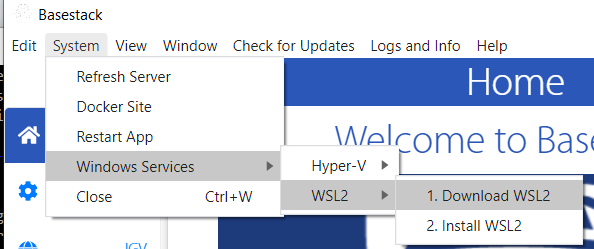

# Basestack

## 1 Install Docker

	* Windows 
		- https://docs.docker.com/docker-for-windows/install/
	* Mac
		- https://docs.docker.com/docker-for-mac/ 
	* Linux (Ubuntu)
		A. Rootless - RECOMMENDED
			- https://docs.docker.com/engine/security/rootless/
				- If you already have `docker` installed, see documentation on [`docker context`](https://docs.docker.com/engine/security/rootless/#client) to switch between rootless and rootful
		B. Rootful (gives root access, use if you already have docker installed or use it regularly)
			- https://docs.docker.com/engine/install/ubuntu/
			- Post-Installation Steps:
				1. Create Docker group
					a. `sudo groupadd docker`
				2. Add your user to the docker group
					a. `sudo usermod -aG docker $USER`
				3. Ensure all root-created files map as your user id in docker containers and volumes (Do both of these)
					a.1. `echo $USER:$(id -u):1 | sudo tee -a /etc/subuid`
					a.2. `echo $USER:$(id -g):1 | sudo tee -a /etc/subgid`
				4. Create Docker container namespace
					a. `echo "{\"userns-remap\": \"$USER\"}" | sudo tee -a /etc/docker/daemon.json`
						- If you dont have the file already created (isn't created by default)
					b. Manually add your user by following the instructions here: https://docs.docker.com/engine/security/userns-remap/.
						- You can disable the `userns-remap` functionality by deleting the `daemon.json` file described above or removing the line attributed to your user
				5. Check that the subgid and subuid files are correct. Order of these lines matters in that the `<username>:<uid>:1` must come first in each file
					a.1. `cat /etc/subuid`
						-`<username>:<uid>:1`
						-`<username>:100000:65536`
					a.2. `cat /etc/subgid`
						-`<username>:<uid>:1`
						-`<username>:100000:65536` 
				6. Restart Docker 
					a. `sudo service docker restart`
					b. OR Restart your computer/session

		
## 2 Install Basestack

1. Download Basestack from https://github.com/Merritt-Brian/Basestack/releases
2. Choose your download based on your operating system from the Releases page:
	- Windows
		- Basestack Setup 1.0.0.setup.exe (~80 MB)
			- Basestack will be installed in your applications listing similar to Microsoft Office or Adobe. THIS STEP REQUIRES ADMIN ACCESS TO YOUR LAPTOP TO INSTALL SOFTWARE
	- Mac
		- Basestack-1.0.0.dmg 
			- Basestack will be installed into `/Applications`
	- Linux
		-  Basestack-1.0.0.AppImage (~100 MB)
	- Expect to use about 14GB after full installation of all analysis pipelines available.
3. (OPTIONAL - If installed from gDrive) Extract the zip or .tar.gz file (If compressed)
	- Note: Make sure you fully extract the file and don't just double-click on it
4. Start Basestack by opening (double-clicking) the following file:
	- Windows: 
		- Basestack Setup ${version}.exe
			- You'll be prompted to select the install location
	- Mac: Basestack.dmg
		- Drag + drop (when the window appears) into `/Applications`
	- Linux: Basestack-${version}.AppImage
		- You'll likely need to change permissions to allow execution in properties e.g. `chmod 755 ...AppImage` or `chmod +x ...AppImage`

## 3. Download Analysis Pipeline(s)

- Once Basestack opens up, click 'Module Install' in the left panel.
- Click 'Install' (play-circle)
	- You may choose online or offline method. Online is default. See more information below in [Section A3](#a3-download-analyis-pipelines)
- Click 'OK' on the small notification window that opens up.
- Follow the *Docker Install Log* to monitor progress and see when the analysis pipeline is ready for use (about 30-45 minutes on a fast internet connection)
- Download the [`test-data.zip`](https://drive.google.com/file/d/1zrgwheJxhMTvd7zu0fuRhVYYM0aGY5XS/view?usp=sharing) file available [here](https://drive.google.com/drive/folders/1ad2U3zBTHXfly3_ybLUxJBarvHXCPS2Z)

## 4. Troubleshooting
- Request or view feature changes at our [issue tracker](https://github.com/jhuapl-bio/Basestack/issues)
- If you run into issues with the online install, you may want to download (or otherwise obtain) the offline install package
	- Using the above download links, download the appropriate docker images you'd like e.g. basestack_consensus.tar.gz (~5.2GB)
	- With the 'Module Install' tab, select the gear icon and switch install method to 'offline'
	- Drag or Browse to that file on YOUR SYSTEM into the appropriate file input space
	- Click 'Install' (play-circle button)
- See below Appendices for more detailed installation instructions. 

## Appendices

### A1 Install Docker

#### A1.1 Windows Install Process for Docker (Click below)

View Steps (Click here)

1. Head over to the [Docker](https://docs.docker.com/docker-for-windows/install/) website to install **Docker**

2. Choose **Get Docker**

3. Choose **Save File** from the prompt

4. Once you've installed docker for Windows, you can start it at the **Quick Launch** by search **Docker**. You can also view it on your right-hand-bottom tray by right-clicking

5. Here Docker provides a GUI environment to manage your system. You can allocate or limit resources to your containers as well as set networking settings if you'd like. **We use default values for our app**

6. **OPTIONAL** Choose Local drives to share with containers. Useful if you're storing data on an external drive.

7. Main image that allows you to manage specific containers 

#### A1.2 Confirm Docker is Running

View

##### Windows

In your taskbar (lower-right), if you hover over the icon you should see the message displayed below. Right-clicking will give additional options

##### Linux or Mac

Open a terminal and type `docker info`. You should see information about your `docker` service

#### Common Errors

##### Hyper-V Not Enabled - Windows

If you are on older Windows distributions, you may experience an error when attempting to start docker on how HyperV is not enabled. 

##### A. Enable Hyper-V in Basestack

To enable it within Basestack select: `System -> Windows Services -> Hyper-V -> Enable Hyper-V`. 

A window will appear prompting admin rights and then it will automatically being the enable process. See more below.

##### B. Enable Hyper-V in Windows System

**Alternatively** you can enable it within the Host system itself by searching for "Turns Windows features on or off" and selecting "Hyper-V". This will require a computer restart

##### WSL2 Not Installed - Windows

The error (seen below) is often shown for newer Windows OS types. If this occurs, you may have different variants. In the included example, I have the option to enable WSL or use Hyper-V. 

Sometimes, another window will appear regarding installing WSL. 

##### A. Install WSL2 from External Sources

Please follow that **[link](https://docs.microsoft.com/en-us/windows/wsl/install-win10#step-4---download-the-linux-kernel-update-package)**. 

Make sure to perform **AT LEAST step 4**. Once WSL2 is installed/enabled, please restart Docker Desktop

##### B. Install WSL2 in Basestack

**Alternatively** Basestack allows users to download WSL directly.

To Download then Install it within Basestack do: 

1. `System -> Windows Services -> WSL2 -> Download WSL2`
2. `System -> Windows Services -> WSL2 -> Install WSL2`

You can then attempt to restart Docker Desktop. This also may require a system restart.

If you are still experiencing issues, attempt to enable virtualization from Basestack:

3. `System -> Windows Services -> WSL2 -> Turn WSL On`
4. `System -> Windows Services -> WSL2 -> Enable Virtualization`
5. `System -> Windows Services -> WSL2 -> Set WSL2`

**Or** from "Turn Windows features on or off". This is also a good way double check that it is now enabled.

**You will need to restart your PC/Laptop after doing this!**
 

#### Virtualization Disabled - Windows

In order for either of the above to work, you need to ensure that **virtualization** is enabled in your firmware. Some processors do so by default, others do not. If you are having issue with starting Docker despite following either of the options above, please see below.

You can first check if it is enabled by going into the **Task Manager** and seeing if the Virtualization attribute is enabled.

If it is not, open up **Command Terminal** and type: `systeminfo`. Scroll to the bottom of the output and check if the Firmware has it enabled for Hyper-V requirements.

If not, you will need to enable Virtualization in your BIOS. This process will look different based on everyone's system. You should try to follow the instructions in this [link](https://www.thewindowsclub.com/disable-hardware-virtualization-in-windows-10). Choose your manufacturer type. 

Typically, though, to enter BIOS you must restart the computer and while it is booting hit **DEL** or **F2** or sometimes **F12**. This process is usually very quick so be ready. When it is booting, you may be able to catch the necessary keys flash.

The default BIOS should look like the one below. In there, head to the **Advanced** tab and check if **Virtualization** is present. If so, enable it, save changes, and restart. If not, try to search in other tabs or open up some options that have further submenus within them as there is no guarantee it will be directly on the base **Advanced** tab. 

On AMD CPU's if you don't see virtualization it may be labeled as **SVM** in the **Advanced** tab

If the option is not present in the BIOS that means that your CPU does not support Virtualization and Docker **won't be able to properly run on your system.**

View More Common Errors

##### I/O timeout

If installing as the offline method, sometimes you may retrieve and I/O exception as an error message. This is typically because you've tried to send docker to build too many images from large files in a short period of time. To fix this, you'll need to rerun docker a specific way

- Simply seach for Hyper-V Manager in your toolbar, select the VM (usually your username is in its name), and then *Turn Off*. Docker will then shut down and you can restart it

##### Docker Connection

If you receive an error that you couldn't connect to docker, please try to restart via the taskbar

##### 'You are not allowed to use Docker, you must be in the "docker-users" group' - Windows

In Basestack select `System -> Windows Services -> Add User Docker-Users`. When completed you should see that either you're already a part of that group **OR** you've been successfully added.

**Alternatively** if the above does not work try the following:

- In the Windows search taskbar (bottom left icon), find `Computer Management`

- Select (left-side) System Tools -> Local Users and Groups -> Groups

- Double click `docker-users` and see if your name is there, if not: 

- Select the `Users` folder right about where you clicked `Groups`
- Select the name of your user
- enter `docker-users` into the object field and add.
	- You will need to log out and back into your account for this to take effect

#### Permisson denied (Linux)

Please ensure that you follow the correct [instructions](#1-install-docker) here to using `userns-remap`

Note that this will map all of your processes INSIDE the docker containers to your user id if used properly. You will need sudo to delete any files or folders that are causing issues.

### A2 Install Basestack

Please choose one of the 2 following methods of install for your use case

#### A2.1 Production Mode (Most Users) 

RECOMMENDED for most users
	* Double Click Your Executable
		- Windows: Basestack.exe
		- Linux: Basestack.AppImage
		- OSX:  Basestack.dmg 

For example, on Windows, your directory will look like: 

You will double-click the Basestack.exe file to open the application

#### A2.2 Developer Mode

View Steps (Click here)

Prereq: python3, miniconda or anaconda environment (Windows Developers only. Installation handled for Mac and Linux in `make` process)

1. Install `make`
	- If on Windows you can get this in a conda environment
2. Clone this repo using `git clone`. 
	- All source code will be obtained in the folder. 
3. Build Conda Environment using `conda`
	- `conda env create -f environment.yml`
	- `conda activate basestack`
4. Build the App or Run in Development Mode
	- Building the app and dependencies `make build-[unix|win]`
	- Running hot reload for development `make dev`
		- Dependencies must be already installed with `make build-[unix|win]`

<strong>Only do this step (below) if you don't have conda installed</strong>

View Details (click here)

https://docs.anaconda.com/anaconda/install/

Examples:

	Ubuntu: 
		- wget  https://repo.anaconda.com/archive/Anaconda3-2019.10-Linux-x86_64.sh
		- bash Anaconda3-2019.10-Linux-x86_64.sh
	Mac 
		- https://docs.anaconda.com/anaconda/install/mac-os/
	Windows 
		- https://www.anaconda.com/distribution/#windows

##### Conda on Windows Install Process 

View Steps

1. Select **Python3.7** version of Anaconda to install and choose **Save File**

2. Wait for the process to bring up the user interface. Select **Next** several times until you get to the install directory location

If you'd like a new install location specify here. You will need to supply this path for **Step 2**

##### Note

* Both the back and frontend will be started by this command. However, we intend in future releases to utilize websockets to update information to the user interface rather than a separate backend server being served on the host. 

* If you want to build for distros that aren't your own (e.g. Build windows on an ubuntu machine), you will need to download the required third-party apps for this (in this example, wine). Take a look [here](https://www.electron.build/multi-platform-build) for more documentation. You can't run `make build[unix|win]` either, you must run the `npm` commmand for it (located in `client/package.json`).
	- You can run `npm run build:[win,linux,mac-dmg, mac-zip]` to accomplish this in `client`. Leave the value after `:` blank if you want to opt for your host platform.
	- Currently, there is not support for building a .dmg file on another OS (Windows, Linux). You will have to build a zip folder with the app with `npm run build:mac-zip`. Mac users can run the default build OR `npm run build:mac-dmg`
	
* Mac OSX has not been fully tested for either installation and run/building
* Current Containers to Build:
	- Artic
* Upcoming Containers:
	- [Nextstrain](https://nextstrain.org/help/coronavirus/SARS-CoV-2)
	- [IGV](https://igv.org/)
	- [Mytax](https://github.com/tmehoke/mytax)

### A3 Download Analyis Pipelines

Select *Settings* and Select *Offline* or *Online* Installation of Docker Images

1. Online: Builds the docker images directly from scratch. Recommended for production builds with stable internet access.
	- Click *Install Docker image files Online*. This process can take upwards of 45 minutes depending on internet speeds. please be patient. Once complete, you will receive a notification that the image(s) are ready and you can begin analysis!
		- If you have slow internet speed you may get a message that the image failed to build. Attempt to retry the build process a few more times and see if it works. This usually happens after the first output line has been given and is dependent on how fast your communication with Docker Hub is.
2. Offline: Does not require stable internet. Builds the docker images from a large docker image. Recommended method for OFFLINE usage only.
	- Download your offline image `basestack_consensus` from the source location (described in section 2 above).
	- If you're using a Mac or Linux Operating system for the offline image, you must have write/read access to the UID/GID: 1000/1000
	- Once the app is opened, drag+drop the file (or browser to it by clicking the offline input box) into the offline install box (next to gear icon). Click *Install Docker image files offline*. This process can take some time but a notification will pop up when done. If this doesn't work, please choose the *Online* method described above (Option 1)
		")

#### Note

These processes can take some time for either method. Rest assured that it will complete. For the online mode, if you receive a warning that the docker image didn't build, try to rerun it a few more times. Interruptions specifically with internet do occur at times but the process will pick up right back where you last left it. If you keep getting the warning notification, also try refreshing the app at `View -> Reload or Force Reload` on the top left. You can also hard fresh the app by restarting it altogether (quit and re-enter).

### A4. Running Consensus Generation and Reporting

Consensus Generation is the main feature of this application and is used to generate a report of a run directory that was generated from a MinION run. It has multiple steps but is designed to be very automated once a job is submit for analysis.

<strong>Step 1</strong>

1. Select the appropriate test folder first. This folder is either included in the `test-data` folder in the source of this application OR you can retrieve it within the install location of the app. For example, in `C:\Program Files\Basestack\client\data\test-data`. 
	- You can either drag + drop it into the *Run Folder* field or select it by left clicking and browser to the directory location on your computer

2. Once a folder has been input, you should see the text fields populate and turn green. If any field is marked as read, it is invalid and should be looked at further for proper formatting. These files should be valid for the test dataset. If you want to use your own data please follow the formatting in `run_config.txt`, `run_info.txt`, and `manifest.txt`. These formats are like:

<strong>You may skip this portion if you'd like</strong>

1. `run_config.txt`

|     Column 1     |	Column 2              |
|-------------|---------------------------|
| primers     | nCoV-2019/V3              |
| basecalling | dna_r9.4.1_450bps_hac.cfg |
| barcoding   | barcode_arrs_nb12.cfg     |

- This should be 3 rows that dictate the primer (first), basecalling workflow (second), and barcoding cfg (third/last). Separate by tab. 

2. `run_info.txt`

|	   Column 1     |	Column 2              |
|-------------|---------------------------|
|    title     | plate 6, row c              |

- This should be a single row that contains title on the left ALWAYS and short description on the right. Separate by tab

3. `manifest.txt`

|	   Column 1     |	Column 2              |
|-------------|---------------------------|
| NB01    | NTC (always required somewhere in manifest.txt)             |
| NB02    | MDHP-00058             |
| NB03    | MDHP-00059             |
| .    | .             |
| .    | .             |
| .    | .             |

- This should be any number of rows that contain barcode on the left ALWAYS and the sample code on the right. A no-template-control (NTC) must always be specified for a report to be completed. Separate by tab.
- You are allowed to input your own custom values for each of the 3 files where the app will overwrite that corresponding file on a job submission. That means you can populate these fields by either directly modifying the files OR by inputting them into the input fields
	- These values are currently not validating to their greatest extent so take care to correctly input values and delimit them with tabs if doing this manually.

<strong>Step 2</strong>

1. Once a folder is input and all greens are seen for the three main files, hit bookmark. The application will save all information and if any error occurs it will be reported appropriately. Please be aware that the software does not catch everything that could go wrong before a job submits

<strong>Step 3</strong>

1. Once bookmarked, hit the newly-shown *Load* button to load it into the run. This will allow this tab and *RAMPART* to make use of your specified run directory. 

2. Hit `Make Consensus` to start consensus generation. 

*Note*: Depending on your method of installing Docker on Windows, you may receive a notification for docker to share a folder. Hit okay to allow the pipeline to continue. If you run Basestack as an admin, this error will be avoided. You can also opt to share the Basestack folder and sub-folders in the Docker Desktop on Windows as well (see how to do this in the next 2 images)

- Simply select the folder that contains the `Basestack.exe` file by selecting the plus-mark and navigation and selecting it within the browser. In this example it is: `...\build\win-unpacked`

<strong>Step 4</strong>

1. You can see the output of the run in the `Log Streams` tab on the left. You can also see the *Statuse(s)* column begin to change as modules are completed for your run. The final module is the report generation module and should always be *1/1* when complete

<strong>Step 5</strong>

1. Once complete, you can view the pdf report by clicking the *pdf* link underneath the final row's status of *1/1*. You can also traverse to any of the module directories by hitting the link text on the first column for each module. In this example, I've chosen *Report Generation* as my link which is a top-level view of all modules, as well as the `report.pdf` location. Open this pdf to see your report either from the folder or the *pdf* link on the left-most column to see your results!

### A5. Running RAMPART

Rampart is an annotation tool provided by the Artic Network that gives quick, but less accurate reports for each of your demuxed samples. It is ideal for a quick look into what the annotations for each of your barcodes are but should not be fully relied on, instead opt for the pipeline that was just discussed.

1. Ensure you've loaded a run that has been bookmarked from the previous tab (described above). 
2. Select one of the included primer-schemes from the drop-down list. For this example, the data is ncov-related so we will choose rampart-ncov-2019.
3. Select *Run Rampart* and wait a few seconds for the window to appear. If nothing appears, please hit *Refresh Rampart* and see if the window then appears. Only attempt this if a success message appears after running.

<!-- #### Note
 * You MUST select the parent directory of the files:
 	- `genome.json`
 	- `primers.json` 
 	- `protocol.json`
 	- `references.fasta`
 * If you dont see RAMPART initialize, try to REFRESH
 * You can stop RAMPART at any time with the STOP button. You will need to do that in the app or the app will continue to run
 	- If you dont want to start up the app to remove, on your terminal type to force remove the processes: 
 		- `docker container rm -f artic_consensus rampart` 
 * You MUST select the top level parent folder for RAMPART to run for the RunDIR e.g. select `fastq_pass` not `test-data`
 -->

### A6. Nextstrain 

<strong>Requires Internet. Also available at https://nextstrain.org/ncov/global</strong>

After the app has generated consensus genomes from the previous 2 commands, you can view mutations or SNPs in your run by selecting the Nextstrain tab at the left-hand side. These mutations can be viewed around Page 11 or section 5.3

Let's go into our report we just generated and traverse to section 5.3 or page 10-11. The tables provided are all reported mutations against the reference.

- Position 18736 (for example) is a reported SNP for T to C mutation. The annotatin is a missense_variant (see all annotation types in the description of this figure for the report). Though nextstrain we can view this mutation across all samples available that have been sequences and input into nextstrain's website. 

- Now that we've selected our mutation to view let's move forward through the interactive site

To View a specific mutation (and this one for example) reported in the table, select underneath **Color By**

Genotype -> nucleotide -> [Your number here]

Also, be sure that the dataset is ncov and global. You can change the layout of the visualization(s) with the Tree Options parameters

### A7. IGV 

<strong>Requires Internet. Also available at https://igv.org/app/</strong>

IGV is an interactive environment that allows you to view a genome and see any annotations at a specific position. 

**These plots are also available in the Consensus Generation Pipeline Reports**

1. First, we are going to select our genome of interest, Sars-CoV-2.

2. For our example at position 18736, we can see that it belongs to ORF1ab from the reference and it has a T. As we saw in the report that T was change to a C when compared to the reference. We can also see what protein this position is a part of as well as supplemental information like the `protein_id` or `Dbxref` (references for external database resource)

## SUPPLEMENTAL

### Third Party Tools to use with the workshop(s)

<strong>These tools are optional and not needed to run any Basestack feature</strong>

<strong>They are not bundled within Basestack (supplemental to bioinformatic/genomics analysis) and must be downloaded separately. They are (mainly) discussed in the bioinformatics modules of the workshop provided with Basestack</strong>

* BEAST v1.10.4: 
	- https://beast.community/
	- Available in all 3 OS types

* MEGA X
	- https://www.megasoftware.net/
    - Available in all 3 OS types

* AliView v1.26: 
	- https://ormbunkar.se/aliview/downloads/linux/linux-version-1.26/
	- Available in all 3 OS types

* MAFFT v7
 - https://mafft.cbrc.jp/alignment/software/
 - Available in all 3 OS types

* BEAGLE v3.1.2
build from source (instructions)
	- https://github.com/beagle-dev/beagle-lib/
	- Available in all 3 OS Types

* TempEst v1.5.3
	- http://tree.bio.ed.ac.uk/software/tempest/
	- Available in all 3 OS Types

* Tracer v1.7.1
	- https://github.com/beast-dev/tracer/releases/tag/v1.7.1
	- Available in all 3 OS Types

* FigTree v1.4.4
	- http://tree.bio.ed.ac.uk/software/figtree/
	- Available in all 3 OS Types

<strong>Requires Internet. Also available at https://igv.org/app/</strong>

* IQTree v2.1.1
	- https://github.com/iqtree/iqtree2/releases
	- You will find the executable in the bin sub-folder. Copy all files in bin folder to your system search path such that you can run IQ-TREE by entering iqtree from the Terminal.
 	- Available in all 3 OS Types

* FastTree v2.1.11 (double precision variant)
	- http://www.microbesonline.org/fasttree/
	- Available in all 3 OS Types (Less user-friendly)

* Python3
	- https://www.python.org/downloads/
	- Available in all 3 OS Types

* biopython
	- https://biopython.org/wiki/Download
	- Install after installing/updating Python

<strong>These tools are optional and not needed to run any Basestack feature</strong>

### Special Mentions

* Andrew Rambaut, James Hadfield and Team @ [artic-network](https://artic.network/)
* Trevor Bedford and Team @ [Nextstrain](https://nextstrain.org/)
* UC San Diego and Broad Inst. @ [IGV](https://igv.org/)

## Authors of Basestack

* Brian Merritt
* Tom Mehoke
* Craig Howser

## Uninstalling

Docker Image(s):
	- In Basestack, go to `Module Install`
	- Select: `Remove Docker Images` (trash-bin icon)
		- This will only remove Basestack-specific images
Basestack: 
	- Windows
		- `Add or remove programs` -> Select Basestack -> `Uninstall` 
	- Mac
		- Drag `~/Library/Application Support/Basestack` to the Bin
	- Linux 
		1. Remove the Basestack.${version}.AppImage Folder or Executable
		2. Remove the directory: `~/.config/Basestack`
User Data:
    - Mac OS: `~/Library/Application Support/Basestack (taken from the name property in package.json)>`
    - Windows: `C:\Users\<you>\AppData\Local\Basestack Name`
    - Linux: `~/.config/Basestack`
